# GymRM User Manual
## FlowForceRM — Complete Operations Guide

**Version:** 2.0 — July 2026  
**Application:** flowforcerm.com  
**Support:** admin@mygym.com

---

## Table of Contents

1. [Introduction](#1-introduction)
2. [Getting Started — Logging In](#2-getting-started--logging-in)
3. [Dashboard](#3-dashboard)
4. [Athletes (Member Management)](#4-athletes-member-management)
5. [Memberships & Packages](#5-memberships--packages)
6. [Class Schedule](#6-class-schedule)
7. [Classes](#7-classes)
8. [Staff Check-In](#8-staff-check-in)
9. [Self-Service Kiosk](#9-self-service-kiosk)
10. [Store (Point of Sale)](#10-store-point-of-sale)
11. [Reports](#11-reports)
12. [Communications](#12-communications)
13. [Email](#13-email)
14. [Employees](#14-employees)
15. [Subscriptions](#15-subscriptions)
16. [Web Integration](#16-web-integration)
17. [Activity Logs](#17-activity-logs)
18. [Settings](#18-settings)
19. [Member Portal](#19-member-portal)
20. [User Roles & Permissions](#20-user-roles--permissions)

---

## 1. Introduction

GymRM is the all-in-one gym management platform for FlowForceRM. It handles athlete registration, membership assignment, class scheduling, attendance tracking, revenue reporting, and store sales — all accessible from any browser at **flowforcerm.com**.

### Who This Manual Is For

| Audience | Primary Sections |
|---|---|
| Gym Owner / Admin | All sections |
| Front Desk Staff | 2, 3, 4, 8, 9, 10 |
| Coaches | 3, 6 |
| Athletes (Members) | 19 |

### Key Terms

| Term | Meaning |
|---|---|
| **Athlete** | A gym member registered in GymRM |
| **Service** | A sport or program (e.g., Brazilian Jiu-Jitsu, Boxing) |
| **Package** | A specific pricing tier under a service (e.g., "8 Sessions — ₱3,500") |
| **Subscription** | A membership assigned to an athlete linking them to a service and package |
| **Session** | One class attendance; session-based subscriptions count these down |
| **Check-in** | Recording an athlete's visit to the gym |
| **Member Number** | Unique ID in format NS-XXXXX (e.g., NS-00018) |

---

## 2. Getting Started — Logging In

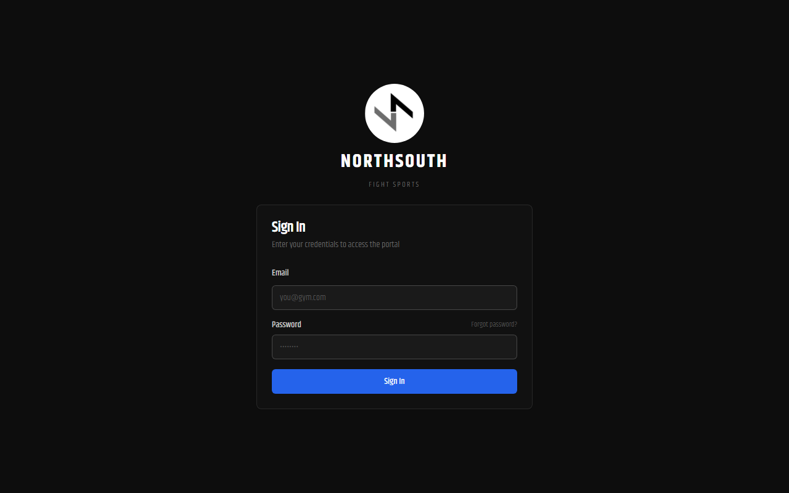

### URL
`https://flowforcerm.com`

### Steps

1. Open your browser and go to **flowforcerm.com**
2. Enter your **Email** and **Password**
3. Click **Sign In**
4. You are redirected to your role's home page automatically

### First-Time Login

New accounts receive an **activation email** with a link to set a password. Click the link, choose a password, and log in normally. If your password was reset by an admin, you will be prompted to change it at first login.

### Forgot Password

1. Click **Forgot password?** on the login page
2. Enter your email address
3. Check your inbox for a reset link (expires after 1 hour)
4. Click the link, set a new password, and sign in

### Role-Based Landing Pages

| Role | Redirects To |
|---|---|
| Admin | Dashboard |
| Staff | Dashboard |
| Coach | Dashboard (coach view) |
| Member | Athlete ID page |
| Kiosk | Kiosk check-in screen |
| Store | Store POS |

---

## 3. Dashboard

**Path:** `/dashboard` | **Roles:** Admin, Staff, Coach

The Dashboard is your home screen after login. The content shown depends on your role.

---

### Admin / Staff View

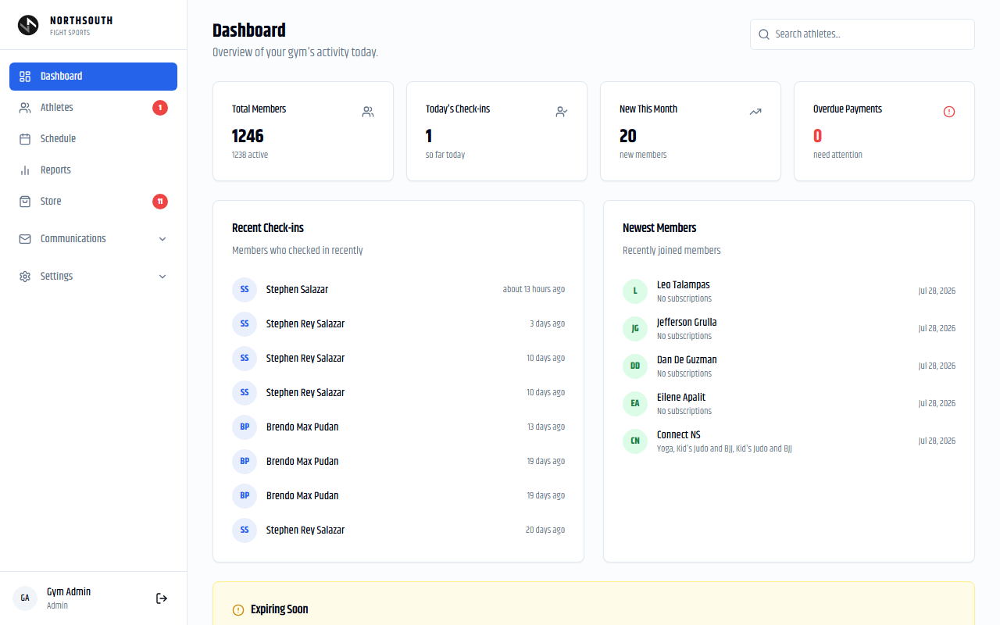

**KPI Cards (top row):**

| Card | What It Shows |
|---|---|
| Total Members | Total registered athletes and how many are ACTIVE |
| Today's Check-ins | Athletes who checked in so far today |
| New This Month | Athletes who joined in the current calendar month |
| Overdue Payments | Count of payments in PENDING or OVERDUE status |

*Live data from the gym: 1,246 total athletes / 1,238 active / ₱60,790 total revenue*

**Recent Check-ins** — The most recent check-ins with athlete name, avatar, and elapsed time.

**Newest Members** — Athletes who joined most recently, with their active subscription pills.

**Expiring Soon** — Subscriptions expiring within the next 7 days. Shows athlete name, service name, and expiry date.

> **Tip:** Review "Expiring Soon" every morning. Contact those athletes before their membership lapses — a timely call or message prevents churn.

---

### Coach View

Coaches see only their assigned classes for today:
- Class name, time slot, and location
- List of booked athletes with check-in status icons
- Check-in count vs. total booked (e.g., "3/8 checked in")

---

## 4. Athletes (Member Management)

**Path:** `/admin/members` | **Roles:** Admin, Staff, Store (view only)

---

### 4.1 Athlete List

Displays all **1,246 registered athletes** in a sortable, searchable table.

**Columns:**

| Column | Description |
|---|---|
| Athlete | Avatar initials, full name, member number |
| Status | ACTIVE / INACTIVE / FROZEN / CANCELLED badge |
| Subscriptions | Color pills: service name with sessions or days left. Green = healthy, Yellow = low, Red = nearly exhausted |
| Email | Address, shown red if bounced/invalid |
| Joined | Date the athlete record was created |
| App Activated | When the athlete first logged in, or "Pending" |
| Last Check-in | Relative time of most recent visit |

**Filtering and Search:**
- Type in the **search box** to filter by name or email instantly
- Use the **status dropdown** to filter: All / App Activated / Not Activated / Active / Frozen / Inactive / Cancelled

**Sorting:** Click any column header to sort ascending; click again for descending.

**Row actions:**
- **View** — Open the athlete's detail page
- **Resend Activation** — Re-send the account setup email (Admin, Staff)
- **Delete** — Permanently delete (Admin only; 2-step confirmation required)

---

### 4.2 Adding a New Athlete

1. Click **Add Athlete** (top right of the Athletes page)
2. Complete the form:

| Field | Required? | Notes |
|---|---|---|
| First Name | Yes | — |
| Last Name | Yes | — |
| Email | No | Required for app access and email notifications |
| Phone | No | — |
| Date of Birth | No | — |
| Gender | No | — |
| Address | No | — |
| Referral Source | No | How they heard about FlowForceRM |

3. Click **Save**
4. The system auto-assigns a member number (NS-XXXXX)
5. If email was provided, an activation email is sent automatically

> **Tip:** Athletes without email can still check in via member number at the kiosk. Add their email later when available.

> **Warning:** Deleting an athlete permanently removes all their history — check-ins, payments, bookings. Use status **CANCELLED** for athletes who leave the gym instead.

---

### 4.3 Athlete Detail Page

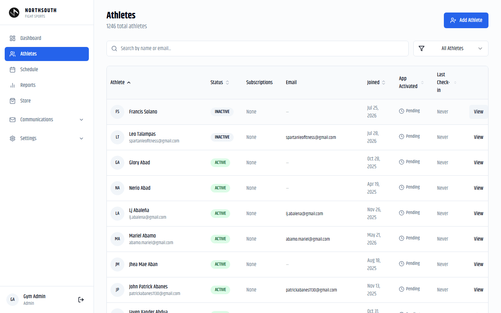

Click **View** on any athlete to open their full profile.

#### Profile Header

- Avatar (click to upload a new photo)
- Full name, status badge, member number
- Contact info: email, phone, date of birth, address, join date, referral source
- Current rank badges per martial art (e.g., BJJ: White Belt)
- **Check In** button — records an immediate check-in for this athlete
- **Assign Membership** button — opens the membership assignment dialog

---

#### Memberships Card

Shows all ACTIVE and PAUSED subscriptions for this athlete.

**Session-based subscriptions show:**
- Sessions used / sessions total (e.g., "6 of 8 used")
- Progress bar: Green (>50% remaining), Yellow (≤50%), Red (≤25%)

**Date-based subscriptions show:**
- Expiry date and days remaining countdown

**Actions per subscription:**
- **Edit** — Adjust dates or sessions remaining (Admin, Staff)
- **Freeze / Unfreeze** — Suspend all memberships (Admin only)
- **Delete** — Permanently remove (Admin only; blocked if bookings exist)

---

#### Assigning a Membership

1. Click **Assign Membership**
2. Select the **Service** (e.g., Brazilian Jiu-Jitsu)
3. Select the **Package**:
   - Session-based: e.g., "8 Sessions" — ₱3,500 member / ₱4,500 non-member
   - Date-based: e.g., "Annual Membership" — ₱1,800/month
4. Choose **Member** or **Non-Member** pricing
5. Optionally apply a **discount**:
   - **Percentage discount** with a preset reason code
   - **Special price override** with one of: Employee Price, Family/Friend Discount, Loyalty Discount, Promotional Rate, Complimentary, Bundle Deal
6. Confirm the auto-calculated **End Date** (Start Date + package validity days)
7. Select **Payment Method**: Cash, GCash, Card, Bank Transfer (BDO/BPI), eWallet (GCash/Maya)
8. Optionally upload a **receipt photo**
9. Click **Assign**

> **Warning:** If the athlete already has an ACTIVE subscription for the same service, a duplicate warning appears. Confirm only if intentional (e.g., topping up sessions before the current pack expires).

---

#### Editing a Membership

1. Click **Edit** on any subscription
2. Modify **Start Date**, **End Date**, and/or **Sessions Remaining**
3. Select at least one **reason** from the preset list, or type a custom reason under "Other"

**Preset reasons:** Admin entry error, Billing correction, Medical / injury extension, Freeze adjustment, Membership transfer, Customer request, Promotional extension

4. Optionally update **Internal Notes** (max 500 characters)
5. Click **Save Changes**

All edits are recorded in the Activity Log with the reason and before/after values.

---

#### Freezing Memberships

Use when an athlete is injured, travelling, or needs a temporary hold.

1. Click **Freeze All**
2. Enter the number of **freeze days**
3. Select a reason
4. Enter your **admin password**
5. Optionally upload a supporting document
6. Click **Freeze**

All active subscriptions change to **PAUSED**. End dates are automatically extended by the freeze duration when unfrozen.

**To unfreeze:** Click **Remove Freeze** and complete the same confirmation steps.

---

#### Other Detail Page Cards

| Card | What It Does |
|---|---|
| Emergency Contact | Store/update emergency contact name, phone, relationship |
| Rank History | Add belt promotions per martial art; view full promotion history |
| Class Attendance | All bookings with status (CONFIRMED/ATTENDED/CANCELLED); cancel individual bookings to return sessions |
| Notes | General notes and medical notes (medical shown with yellow background) |
| Guardian Account | Link a parent/guardian account (for young athletes) |
| Payment History | All payments with method, amount, status; Log Payment button to record new payments |

---

#### Face Recognition Enrollment

1. On the athlete detail page, click **Enroll Face**
2. Allow webcam access
3. Follow the on-screen guide to capture the face
4. Click **Save**

The athlete can now check in at the Face Recognition Kiosk (`/attendance/kiosk`) without a phone or member number.

---

## 5. Memberships & Packages

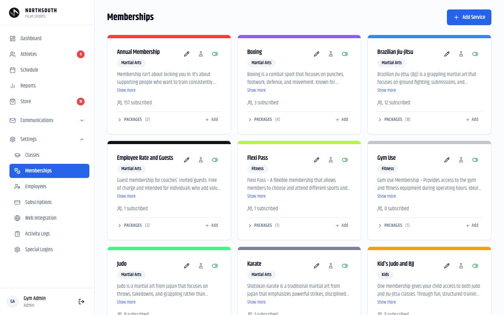

**Path:** `/admin/services` | **Roles:** Admin only

Defines the catalog of sports programs (Services) and their pricing options (Packages).

---

### Current Services

| Service | Category | Description |
|---|---|---|
| Annual Membership | Martial Arts | Gym-wide membership; unlocks member pricing on all packages |
| Boxing | Martial Arts | Combat sport focusing on punches, footwork, and defense |
| Brazilian Jiu-Jitsu | Martial Arts | Ground-based grappling; submissions and positional control |
| Employee Rate and Guests | Martial Arts | Free membership for coaches' invited guests |
| Flexi Pass | Fitness | Multi-sport pass; attend different programs each week |
| Gym Use | Fitness | Access to gym equipment and weights area |
| Judo | Martial Arts | Throws and takedowns; the "Gentle Way" |
| Karate | Martial Arts | — |
| Kid's Judo and BJJ | Martial Arts | Combined kids program |
| Muay Thai | Martial Arts | Eight-limb striking art |
| Taekwondo | Martial Arts | Korean kicking-focused martial art |
| Yoga | Martial Arts | Flexibility, breathing, and mindfulness |
| Zumba | Fitness | Dance-based fitness |

---

### Adding a Service

1. Click **Add Service**
2. Enter: Name, Description, Category, Color
3. Toggle **Free Trial Enabled** if this service should appear on the public free trial registration form
4. Click **Save**

### Adding a Package

1. Click **Add** next to the service's PACKAGES section
2. Enter:
   - **Name** (e.g., "8 Sessions", "Monthly Unlimited")
   - **Sessions** — Fixed number, or leave blank for unlimited
   - **Valid Days** — Package validity period from start date
   - **Member Price** — Price for Annual Membership holders
   - **Non-Member Price** — Standard rate
3. Click **Save**

> **Important:** The **Free Trial Enabled** flag is off by default for all services including existing ones. Manually enable it for each service you want on the public free trial form (BJJ, Judo, Kids classes, etc.).

---

## 6. Class Schedule

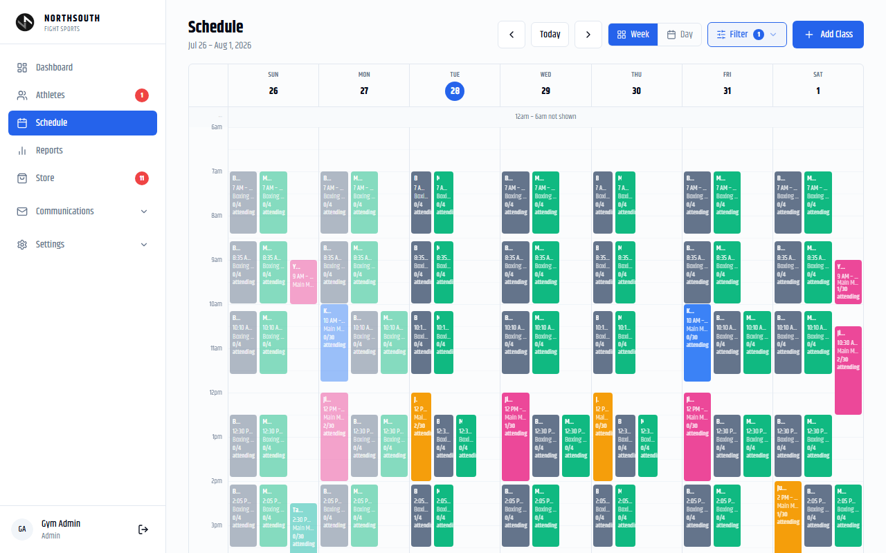

**Path:** `/admin/schedule` | **Roles:** Admin, Staff (view + attendance); Coach (own classes); Store (view)

---

### Navigating the Schedule

- Default view: current week in a **7-column time grid** (6 AM to 10 PM)
- **← →** arrows navigate weeks
- **Today** button returns to the current week
- **Week / Day** toggle switches between views
- **Filter** dropdown shows/hides specific class types

Each class slot shows:
- Class name and color bar
- Time range
- Location
- Attendance count (e.g., **2/30 attending**) — turns yellow near capacity

Past classes appear at reduced opacity.

---

### Classes on the Schedule (Sample Week)

| Class | Days | Times | Location | Capacity |
|---|---|---|---|---|
| Boxing | Daily | 7 AM, 8:35 AM, 10:10 AM, 12:30 PM, 2:05 PM, 3:40 PM, 5:15 PM, 6:50 PM | Boxing Area | 4 |
| Muay Thai | Daily | Same as Boxing slots | Boxing Area | 4 |
| Jiujitsu - Gi | Mon, Tue, Thu | 12 PM, 7:30 PM | Main Mats | 30 |
| Jiujitsu - NoGi | Mon, Tue | 12 PM | Main Mats | 30 |
| Judo | Multiple | 5:30 PM | Main Mats | 30 |
| Kids Judo and Jiujitsu | Multiple | 5:30 PM | Main Mats | 30 |
| Karate | Mon | 10 AM | Main Mats | 30 |
| Taekwondo | Sun | 2:30 PM | Main Mats | 30 |
| Yoga | Sun | 9 AM | Main Mats | — |

---

### Adding a Class to the Schedule

1. Click **Add Class** (top right)
2. Choose the **Class type** from the Classes list
3. Select **Recurring** or **One-time**
4. For recurring: check the **days of the week** and set **Start Date** (and optional End Date)
5. Set **Start Time** and **End Time**
6. Select **Location**: Main Mats, Boxing Area, Weights Area, or Mezzanine
7. Set **Max Capacity** (leave blank for unlimited)
8. Assign **Coach(es)** — dropdown is filtered to coaches who teach that service
9. Click **Save**

---

### Viewing a Class Slot (Attendance Dialog)

Click any slot on the schedule:

| Tab | What It Shows |
|---|---|
| Booked | All athletes booked with attendance checkboxes |
| Check-ins | Athletes who have checked in |
| Add Athlete | Search to add members or employees |

**Taking attendance:**
1. Click the class slot
2. Check the box next to each athlete who attended
3. Status automatically changes from CONFIRMED → ATTENDED

**Adding an athlete to a class:**
1. Click the slot → **Add Athlete** tab
2. Search by name
3. Select the athlete — they are booked immediately if they have an eligible subscription
4. Employees in paid classes (Boxing, Muay Thai, Yoga) trigger a payment dialog
5. Employees in free classes are auto-booked with a ₱0 Employee Rate subscription

**Adding a guest:**
1. Click **Add Guest** in the Add Athlete tab
2. Enter the guest's name
3. A temporary INACTIVE member record is created and they are booked

---

### Editing a Recurring Schedule

Click **Edit** in the slot dialog. Choose scope:

| Option | Effect |
|---|---|
| Just this session | One-time override for this date only |
| This and succeeding sessions | Cuts the series at this date; creates a new series from here |
| All sessions | Edits all past and future occurrences |

### Deleting a Class

Click **Delete** in the slot dialog. Choose scope:
- **This session only** — Creates a cancellation exception; recurring series continues
- **This and all succeeding** — Ends the series at this date

> **Warning:** Deleting a schedule slot does **not** cancel athlete bookings automatically. Booked athletes keep their confirmed bookings but the class will not appear. Manually cancel individual bookings if needed to return sessions.

---

## 7. Classes

**Path:** `/admin/classes` | **Roles:** Admin, Staff, Store (view); Admin (add/edit/delete)

Defines the master list of class types — what they are, where they are held, and which memberships grant access.

**Current class types:** BJJ Open Mats, Boxing, Gym Use, Jiujitsu - Gi, Jiujitsu - NoGi, Jiujitsu Fundamentals - Gi, Judo, Karate, Kids Judo and Jiujitsu, Muay Thai, Taekwondo, Yoga, Zumba

### Adding a Class Type

1. Click **Add Class**
2. Enter: Name, default Location, Notes
3. Select **Allowed Memberships** — which service subscriptions permit entry
   - Leave empty to allow all valid subscriptions
   - Select specific services to restrict (e.g., "Boxing" class → only Boxing and Flexi Pass)
4. Click **Save**

**Current Allowed Memberships by class:**

| Class | Allowed Subscriptions |
|---|---|
| Boxing | Boxing, Flexi Pass |
| Muay Thai | Muay Thai, Flexi Pass |
| Jiujitsu - Gi | Brazilian Jiu-Jitsu, Flexi Pass, Kid's Judo and BJJ, Employee Rate and Guests |
| Jiujitsu - NoGi | Brazilian Jiu-Jitsu, Flexi Pass, Kid's Judo and BJJ, Employee Rate and Guests |
| Judo | Judo, Flexi Pass, Kid's Judo and BJJ |
| Kids Judo and Jiujitsu | Kid's Judo and BJJ, Employee Rate and Guests, Flexi Pass |
| Karate | Karate, Flexi Pass, Employee Rate and Guests |
| Taekwondo | Taekwondo, Flexi Pass, Employee Rate and Guests |
| Yoga | Yoga, Flexi Pass, Employee Rate and Guests |
| Gym Use | Gym Use, Flexi Pass |

---

## 8. Staff Check-In

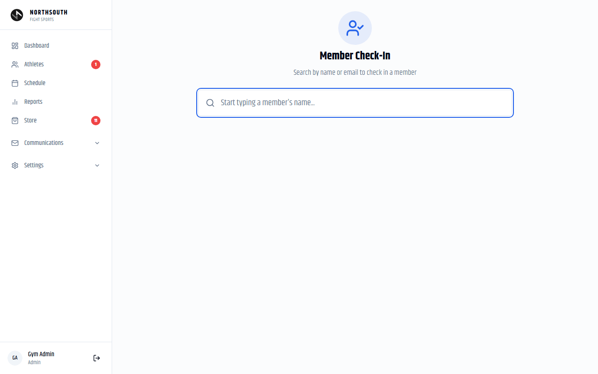

**Path:** `/staff/checkin` | **Roles:** Admin, Staff

Allows front desk staff to check in any athlete by searching their name — faster than waiting for the kiosk.

### How to Check In an Athlete

1. Type the athlete's **name or email** in the search box
2. Up to 8 matching results appear with:
   - Athlete name and avatar
   - Status badge
   - Active subscriptions with sessions remaining
   - Last check-in time
3. Click **Check In** on the correct athlete
4. The check-in is recorded and one session deducted (if session-based)

**Already checked in today?** A dialog appears: *"Already checked in at [time]. Check in again?"* — click **Check In Again** to confirm or **Cancel** to dismiss.

> **Tip:** Check-in deducts sessions from the athlete's **oldest active session pack** first (FIFO queue). If they have only unlimited (date-based) subscriptions, no session is deducted.

---

## 9. Self-Service Kiosk

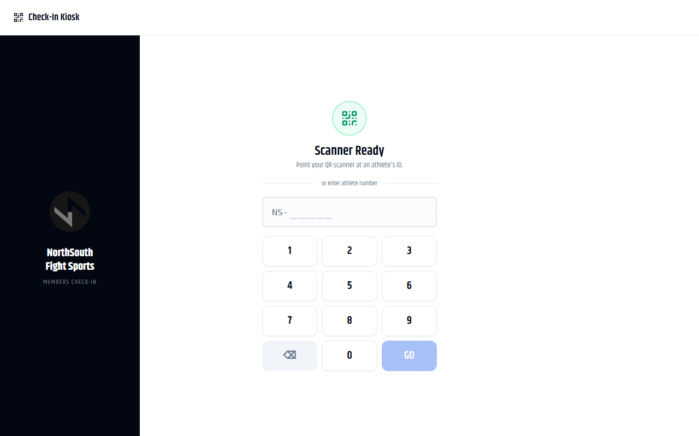

**Path:** `/kiosk` | **Login:** kiosk@flowforcerm.com | **Roles:** Admin, Staff, Kiosk

A dedicated self-service terminal at the gym entrance where athletes check in independently.

### QR Code Check-In

1. Athlete opens the GymRM app on their phone → **Athlete ID**
2. A QR code is displayed (unique to their member number)
3. Athlete holds their phone to the QR scanner
4. Check-in is recorded; success screen shows their name and membership status

### Member Number Check-In

If the athlete doesn't have their phone:
1. Use the on-screen **number pad** to enter the numeric portion of their member number (e.g., NS-00018 → type 00018)
2. Press **GO**
3. Check-in recorded

### Face Recognition Kiosk

**Path:** `/attendance/kiosk` — Admin, Staff only

Athletes who have completed face enrollment check in by looking at the webcam — no phone needed.

> **Warning:** The kiosk enforces a **30-minute cooldown per athlete**. A second scan within 30 minutes is rejected. This prevents accidental duplicate check-ins.

> **Tip:** Keep the kiosk tablet plugged in and the browser pinned to the kiosk URL. The kiosk session never expires.

---

## 10. Store (Point of Sale)

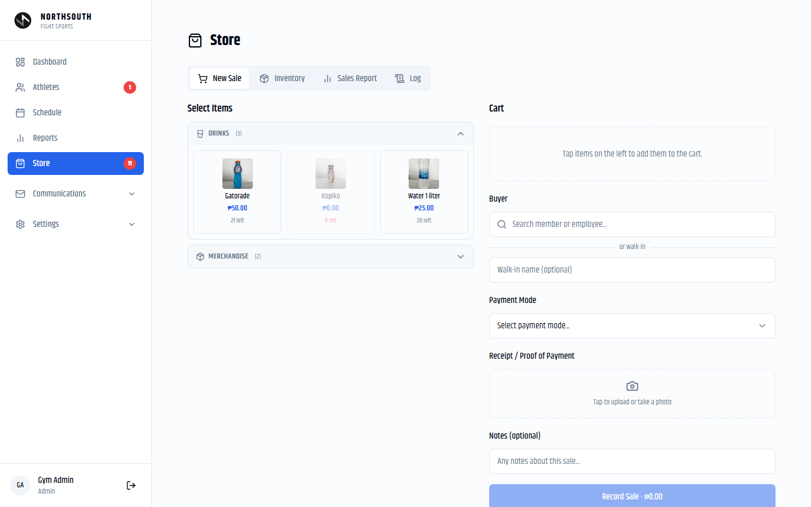

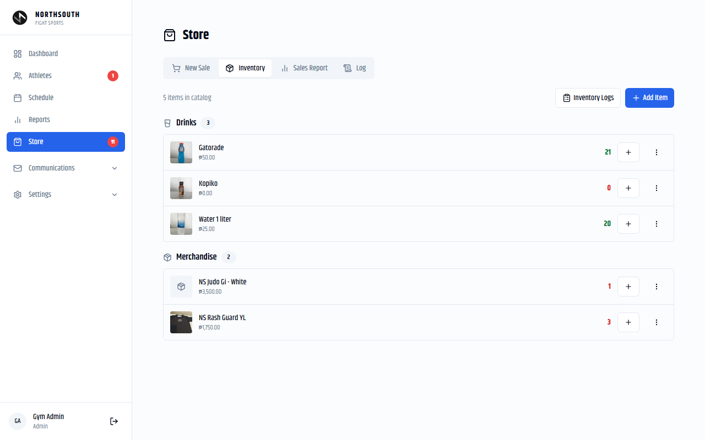

**Path:** `/admin/shop` | **Roles:** Sales: Admin, Staff, Store; Inventory: Admin, Staff

---

### 10.1 Recording a Sale (New Sale Tab)

1. Navigate to **Store**
2. Browse items by category (**DRINKS** / **MERCHANDISE**)

**Current inventory:**
- Gatorade — ₱50.00 (21 in stock)
- Water 1 liter — ₱25.00 (20 in stock)
- Kopiko — ₱0.00 (currently out of stock)

3. Tap/click an item to add it to the **Cart** (right panel)
4. Adjust quantity in the cart if needed
5. Search for a **Buyer** (optional — attach the sale to a member or employee)
6. Select **Payment Mode**: Cash, Credit Card, Bank Transfer (BDO/BPI), eWallet (GCash/Maya), Class Pass
7. Upload a **receipt photo** (optional)
8. Add **Notes** (optional)
9. Click **Record Sale**

**Special price:** Click the price shown in the cart to override it. A reason is required.

> **Warning:** Bank Transfer and eWallet payment modes require selecting a sub-option (BDO/BPI or GCash/Maya). The **Record Sale** button remains disabled until a sub-mode is selected.

---

### 10.2 Inventory Management (Inventory Tab)

**View all items** with stock levels, prices, and active status.

**Adding a new item:**
1. Click **Add Item**
2. Enter: Name, Category, Selling Price, Cost Price, Initial Stock
3. Optionally upload a product photo
4. Click **Save**

**Updating stock:**
- **Count** — Set stock to an exact number (use after a physical inventory count)
- **Adjustment** — Add or subtract (use after receiving a shipment or discovering a discrepancy)
- Enter quantity and reason, then save

**Deactivating:** Toggle the active switch to hide an item from the POS without deleting it.

---

### 10.3 Inventory Log (Log Tab)

Complete audit trail of all stock changes:
- Date, item, change type (Count / Adjustment), quantity change, reason, staff name

---

## 11. Reports

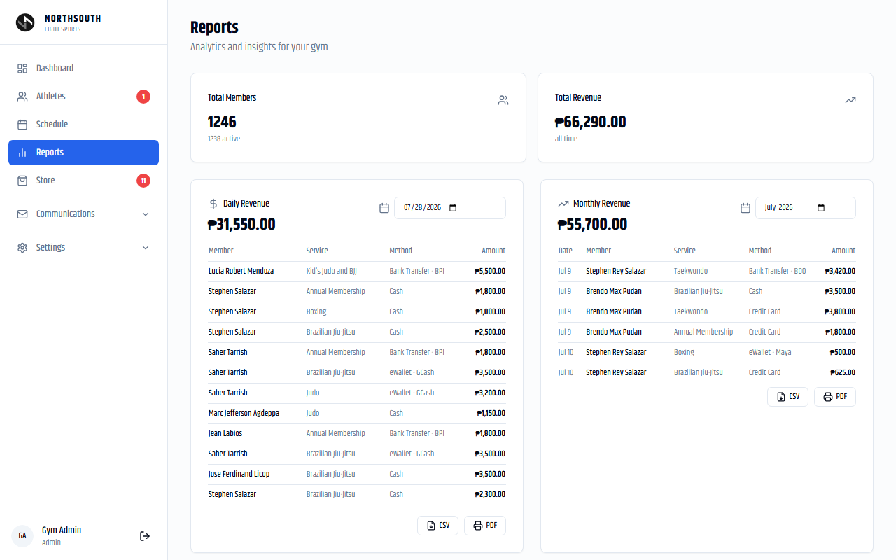

**Path:** `/admin/reports` | **Roles:** Admin only

---

### Summary Stats
- Total Members: **1,246** (1,238 active)
- Total Revenue: **₱60,790** (all time)

---

### Daily Revenue Report

1. Select the **date** using the date picker (defaults to today)
2. View:
   - Total for the day (e.g., ₱26,050)
   - Itemized table: Member, Service, Payment Method, Amount
3. Export: **CSV** (spreadsheet) or **PDF** (print/share)

### Monthly Revenue Report

1. Select the **month and year**
2. View:
   - Monthly total (e.g., ₱50,200)
   - Daily bar chart
   - Itemized table: Date, Member, Service, Method, Amount
3. Export: **CSV** or **PDF**

> **Note:** Employee payments appear labeled as "Name (Staff)" — they are included in revenue totals by design.

> **Tip:** Run the monthly report on the first of each month and export to CSV. Share with your accountant for bookkeeping.

---

## 12. Communications

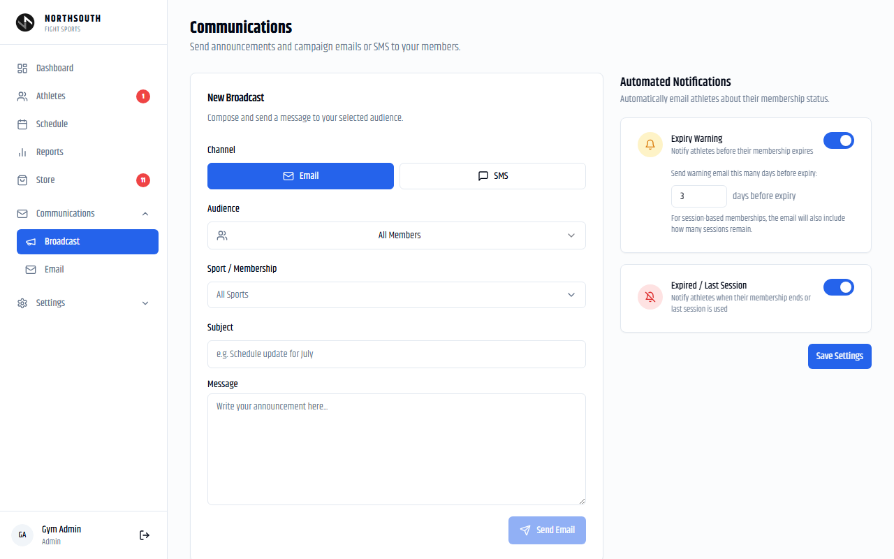

**Path:** `/admin/communications` | **Roles:** Admin only

---

### 12.1 Sending a Broadcast

1. Click **New Broadcast**
2. Choose **Channel**: Email or SMS
3. Choose **Audience**:
   - All Members
   - Active Members
   - Inactive Members
   - Specific Members (search and add individuals)
4. Optionally filter by **Sport / Membership**
5. Enter **Subject** and **Message**
6. Click **Send Email**

**Broadcast history** shows all past sends. Click any entry to expand details or **Resend**.

---

### 12.2 Automated Notifications

| Setting | What It Does |
|---|---|
| Expiry Warning | Sends an email X days before membership expires. Session packs include sessions remaining. |
| Expired / Last Session | Sends an email when membership expires or last session is used |

Toggle each setting on/off and click **Save Settings**.

> **Tip:** Set expiry warning to 7 days. Athletes appreciate the heads-up and it significantly improves renewal rates.

---

## 13. Email

**Path:** `/admin/email` | **Roles:** Admin only

Gmail integration for reading and responding to athlete emails inside GymRM.

**Requires Gmail OAuth setup.** Once connected:
- View **Inbox, Sent, Trash** threads
- Click any thread to read and reply
- **Compose** new emails (To, Subject, Body)
- **Refresh** to sync

> **Note:** Gmail only. Outlook is not supported.

---

## 14. Employees

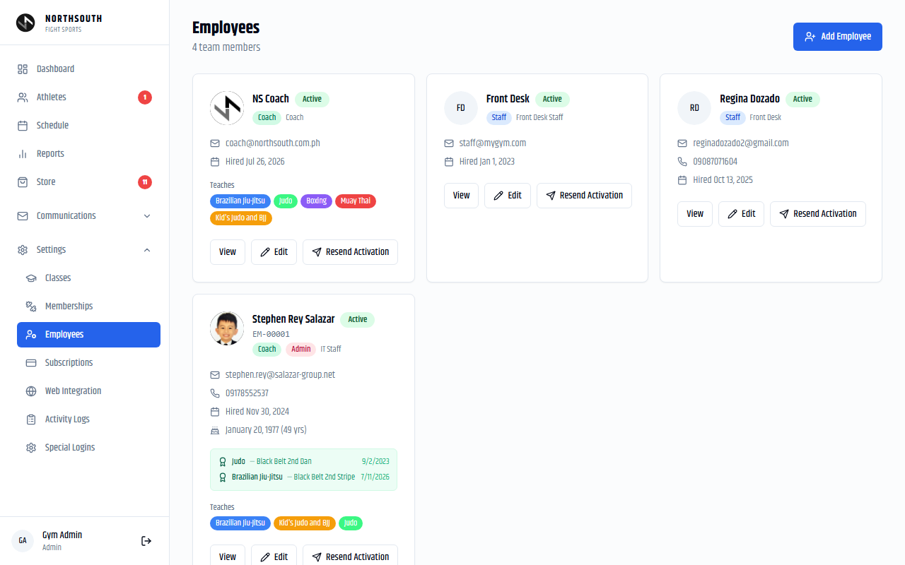

**Path:** `/admin/employees` | **Roles:** Admin only

---

### Team at FlowForceRM

| Name | Roles | Teaches |
|---|---|---|
| NS Coach | Coach | BJJ, Judo, Boxing, Muay Thai, Kid's Judo and BJJ |
| Front Desk | Staff | — |
| Regina Dozado | Staff | — |
| Stephen Rey Salazar | Coach, Admin | BJJ, Kid's Judo and BJJ, Judo |

---

### Adding an Employee

1. Click **Add Employee**
2. Fill in:
   - First Name, Last Name, Email (required)
   - Phone, Date of Birth
   - **Employee Type(s)**: ADMIN / STAFF / COACH (multi-select)
   - Title, Hire Date
   - **Taught Services** (for coaches — determines schedule assignment eligibility)
   - Belt / rank (optional)
3. Optionally upload a profile photo
4. Click **Save** — activation email is sent automatically

### Role Summary

| Type | Access Level |
|---|---|
| ADMIN | Full access to all features |
| STAFF | Athletes, Check-in, Store, Schedule view — no admin settings |
| COACH | Dashboard (own classes only), Schedule (own classes only) |

Employees can have multiple types (e.g., a head coach who is also ADMIN).

---

## 15. Subscriptions

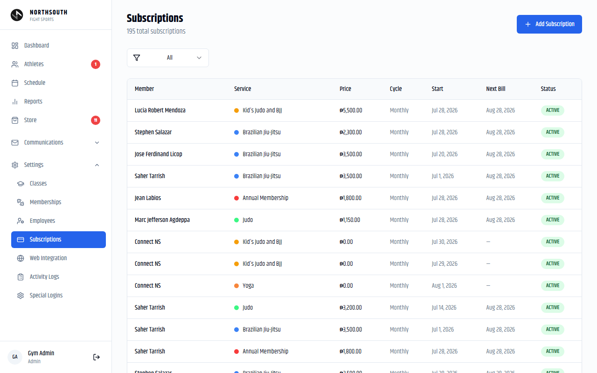

**Path:** `/admin/subscriptions` | **Roles:** Admin only

Global view of all **195 subscriptions** across all athletes.

**Columns:** Member, Service, Price, Billing Cycle, Start Date, Next Bill Date, Status

**Filter:** All / Active / Paused / Expired / Cancelled

**Add Subscription** — Creates a subscription directly without going to the athlete's detail page. Useful for bulk setup.

> **Tip:** For day-to-day membership sales, use **Assign Membership** on the athlete's detail page — it includes payment logging, discounts, and receipt upload in one flow. The Subscriptions page is best for reviewing the full list or bulk management.

---

## 16. Web Integration

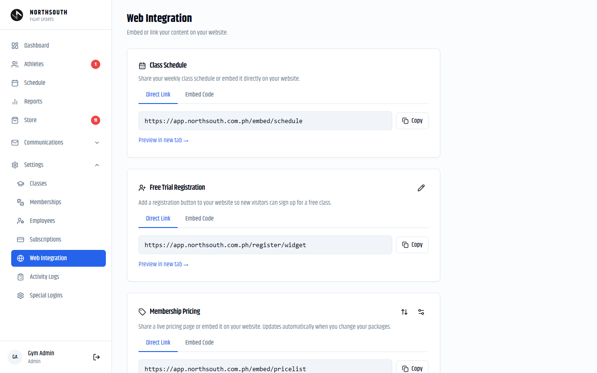

**Path:** `/admin/web-integration` | **Roles:** Admin only

Three embeddable widgets for your gym's website.

### Class Schedule Widget
- Embed the live weekly class schedule
- Updates automatically when you edit the schedule in GymRM
- Provides Direct Link and Embed Code (iframe)

### Free Trial Registration Widget
- Embed a signup form for prospective athletes
- They fill in name, email, phone → receive a link to select a class slot
- New leads appear in Athletes as INACTIVE members with the "Free Trial" badge

### Membership Pricing Widget
- Embed a live pricing page showing your packages
- **Configure visible rates** — check/uncheck packages to show or hide
- **Arrange card order** — drag services to reorder
- Configuration is saved to the database and applies across all devices

---

## 17. Activity Logs

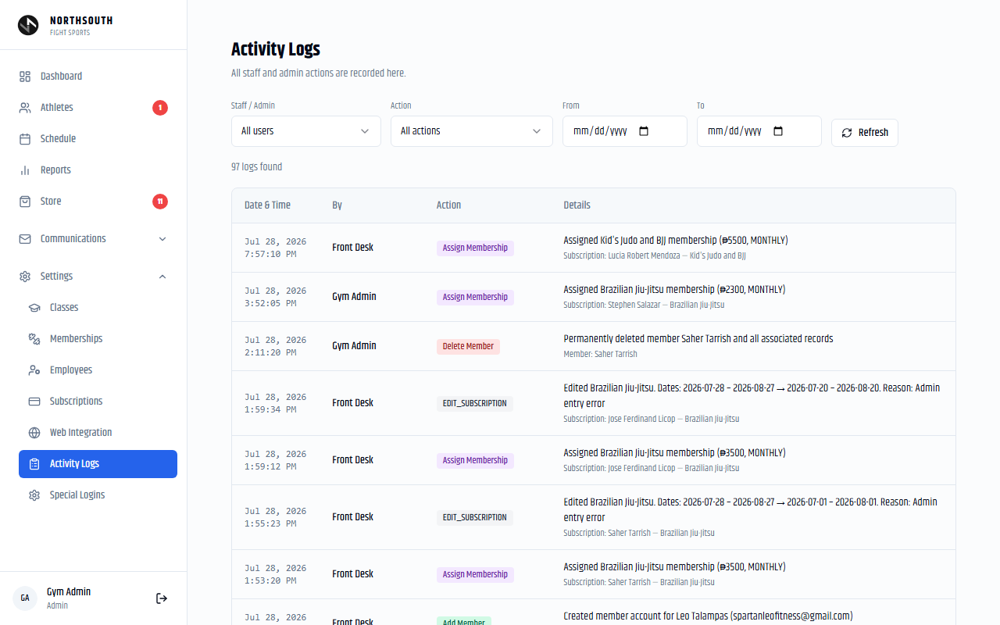

**Path:** `/admin/logs` | **Roles:** Admin only

Complete audit trail of all staff and admin actions — **96 log entries** recorded.

### Logged Actions

| Action | Description |
|---|---|
| Add Member | New athlete created |
| Delete Member | Athlete permanently deleted |
| Assign Membership | Membership assigned with amount and service |
| Edit Subscription | Dates, sessions, or notes changed — shows before/after |
| Delete Membership | Subscription removed |
| Freeze Member | All memberships paused |
| Unfreeze Member | Memberships restored |
| Add/Edit/Delete Schedule | Class schedule changes |
| Cancel Schedule Session | Individual occurrence cancelled |
| Add/Update Employee | Staff record changes |

### Filtering

- **Staff/Admin** — Filter by who performed the action
- **Action type** — Filter to a specific action
- **Date range** — From / To pickers

> **Tip:** If a membership was unexpectedly changed, use the date filter to find the entry and see exactly who changed it and why.

---

## 18. Settings

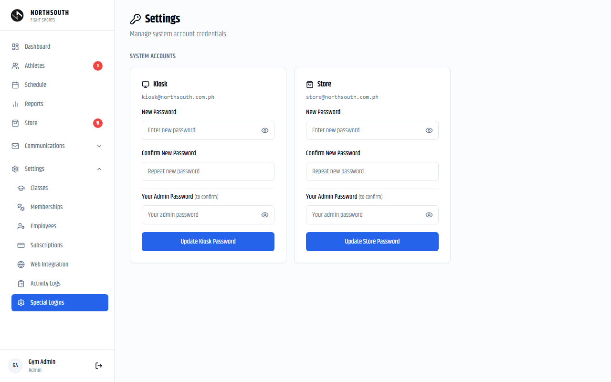

**Path:** `/admin/settings` | **Roles:** Admin only

Manages shared system account passwords for the Kiosk and Store terminals.

### Kiosk Account (kiosk@flowforcerm.com)

The shared login for the self-service check-in kiosk.

To change the password:
1. Enter the new password and confirm it
2. Enter your own **admin password**
3. Click **Update Kiosk Password**

> **Warning:** After changing the kiosk password, the kiosk tablet is logged out. Re-login during off-peak hours. Communicate the new password to staff who manage the kiosk.

### Store Account (store@flowforcerm.com)

Same process for the shared store terminal. Change when store staff changes or a security rotation is needed.

---

## 19. Member Portal

Athletes access a simplified 4-page portal using their personal login credentials.

---

### 19.1 Athlete ID

**Path:** `/member/athlete-id`

Displays the athlete's unique QR code and member number (e.g., **Stephen Salazar — NS-00018**).

- Scan this QR code at the kiosk to check in
- **Download ID** saves the QR code as an image

> **Tip:** Advise athletes to add this page to their phone's home screen. iOS: tap Share → Add to Home Screen. Android: tap menu → Add to Home Screen. One tap to check in.

---

### 19.2 My Profile

**Path:** `/member/profile`

Athletes can view their own information and make limited edits:

| Section | Athlete Can Do |
|---|---|
| Contact Info | Edit phone, address, date of birth |
| Emergency Contact | Add/edit contact name, phone, relationship |
| Rank History | View only (updated by coaches/admin) |
| Class Attendance | View booking history and attendance record |
| Documents | View signed waivers: Liability Waiver, Privacy & Confidentiality, Gym Rules, Welcome Handbook |

> **Note:** Athletes cannot change their name or email address. Contact an admin if these need updating.

---

### 19.3 My Schedule

**Path:** `/member/schedule`

Shows upcoming class sessions that the athlete is **eligible to attend** based on their active subscriptions. Athletes can view class details and book available sessions.

---

### 19.4 My Billing

**Path:** `/member/billing`

**Active Memberships section:**
- Each active subscription with status badge
- Session-based: "X sessions remaining of Y"
- Date-based: expiry date and days remaining

**Payment History table:**
- All payments with package, sessions, date, payment method, amount, and status (PAID / PENDING)

---

## 20. User Roles & Permissions

### Complete Permission Matrix

| Feature | Admin | Staff | Store | Coach | Member |
|---|---|---|---|---|---|
| **Dashboard** | Full | Full | — | Own classes | — |
| **View athlete list** | ✓ | ✓ | ✓ | — | — |
| **Add athlete** | ✓ | — | — | — | — |
| **Edit athlete profile** | ✓ | — | — | — | Own (limited) |
| **Delete athlete** | ✓ | — | — | — | — |
| **Assign membership** | ✓ | ✓ | — | — | — |
| **Edit membership** | ✓ | ✓ | — | — | — |
| **Delete membership** | ✓ | — | — | — | — |
| **Freeze membership** | ✓ | — | — | — | — |
| **View schedule** | ✓ | ✓ | ✓ | Own | ✓ |
| **Add/edit schedule** | ✓ | — | — | — | — |
| **Take class attendance** | ✓ | ✓ | — | — | — |
| **Staff check-in** | ✓ | ✓ | — | — | — |
| **Kiosk check-in** | ✓ | ✓ | — | — | — |
| **Store — sell** | ✓ | ✓ | ✓ | — | — |
| **Store — manage inventory** | ✓ | ✓ | — | — | — |
| **Reports** | ✓ | — | — | — | — |
| **Communications / Email** | ✓ | — | — | — | — |
| **Employees** | ✓ | — | — | — | — |
| **Memberships / Services** | ✓ | — | — | — | — |
| **Web Integration** | ✓ | — | — | — | — |
| **Activity Logs** | ✓ | — | — | — | — |
| **Settings** | ✓ | — | — | — | — |
| **Athlete ID (QR code)** | — | — | — | — | ✓ |
| **My Profile** | — | — | — | — | ✓ |
| **My Schedule** | — | — | — | — | ✓ |
| **My Billing** | — | — | — | — | ✓ |

---

*GymRM User Manual v2.0 — FlowForceRM — July 2026*  
*Source of truth: live application at flowforcerm.com verified July 28, 2026*
